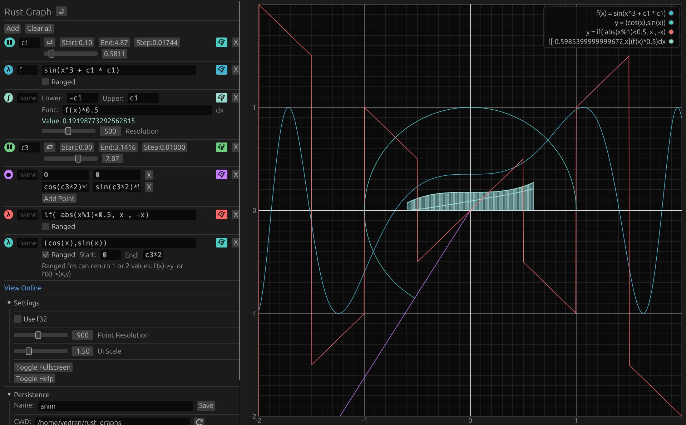

# Rust Graph
Desmos-like graphing calculator with support for f32 numbers.


## Use it online

[Web Demo](https://vdrn.github.io/rust_graph/#BwJjMQEBAQAAAMBrBPU/XaeRlsrbkT8AmpmZmZmZuT97FK5H4XoTQAACYzMBBgEAAABgmJn5P3sUrkfheoQ/AQAAAAAAAAAA8dTIU/shCUABZgECABJzaW4oeF4zICsgYzEgKiBjMSkAAAAAAAAAAIA/AAAAYEAAAQQDCGYoeCkqMC41AAMtYzEAAmMxAPv0AQABBwICATAAATAAC2NvcyhjMyoyKSo1AAtzaW4oYzMqMikqNQAAAQAAGGlmKGFicyh4JTEpPDAuNSwgeCAsIC14KQAAAAAAAAAAgD8AAABgQAABAQAtKGNvcyh4KStjb3MoMjUqeCkqMC4xLAogc2luKHgpK3NpbigyNSp4KSowLjEpAAEBMAAEYzMqMgAAAIA/AAAAYEA=)

## Download prebuilt binaries

[Latest release](https://github.com/vdrn/rust_graph/releases/latest)

## Compile and install locally

Make sure you have recent [Rust compiler installed](https://rust-lang.org/tools/install/).

Then run:
```bash
cargo install --git https://github.com/vdrn/rust_graph
```


## Screenshot

